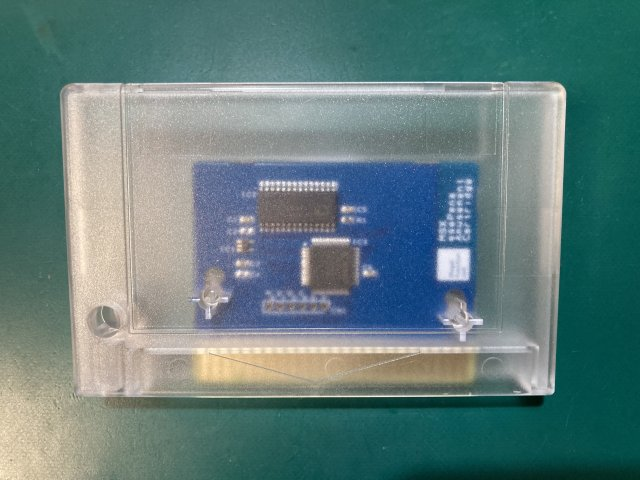
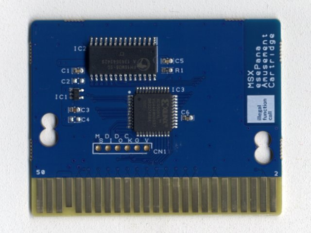
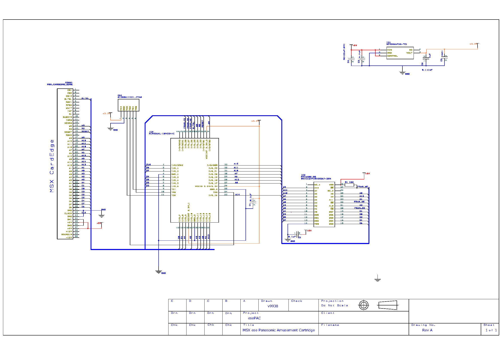

# MSX拡張Cartridge esePana Amusement Cartridge  
  
  

パナソニックから出ていた、MSX用の拡張カートリッジ「Pana Amusement Cartridge」の互換品です。  
本家の方はSRAMでしたが、FRAMを使用しており、SRAMバッテリ切れの同カセットの救済用として使用する事ができます。

参考資料(対応ソフト情報など）：  
https://ja.wikipedia.org/wiki/パナアミューズメントカートリッジ  
カセットは、Boothおよび一部ショップにて販売予定です。  
https://ifc.booth.pm/items/3479171  

## ■ メモリマップ

Pana Amusement Cartridgeと同一仕様です。

| Page (8kB)    | Switching address                  | Initial Setting                     |
| ------------- | ---------------------------------- | ----------------------------------- |
| 4000h ~ 5FFDh | 5FFEh = 4Dh / 5FFFh = 69h (Enable) | 5FFEh = 00h / 5FFFh = 00h (Disable) |

参考：  
https://www.msx.org/wiki/MegaROM_Mappers#PAC_.28Panasoft.29
  
## ■ FRAMの制御方法
書き込みモードにするために、5FFEh = 4Dh / 5FFFh = 69hを書き込んでください。4000-5FFDhがRAM領域になります。  
PACがスロットに実装されているか特定の識別方法はありません。  
スロットを切り替えながら無いので切り替わったかどうかは、5FFEh = 4Dh / 5FFFh = 69hを書いた後に4000h ~ 5FFDhに  
データを書いて確認してください。元々書いてあるデータを破損しないように注意して実装してください。  
※読み書きプログラムでは、chkPacInSlot()で当該動作を実行しています。  

## ■ PAC読み書き/書き込みプログラム
PACへのRAM Read/Writeプログラムとして、pacread/pacwriteを同梱しています。   
いずれかのスロットに当該カードリッジを挿入し、以下コマンドを実行することによりRAMデータのバックアップと書き戻しが可能です。  
また、FM-PACをお持ちの方は、call fmpacのユーティリティを使う事も可能です。  

●バックアップ(読み込み)  
`>pacread.com [書き出しFile]`  
●書き込み  
`>pacwrite.com [書き込みFile]`  
●テストプログラム（データが壊れるので注意してください）  
`>pactest.com`  

ソースコードは、z88dkでコンパイル可能です。コンパイルオプションは下記になります。  
`zcc +msx -create-app -subtype=msxdos -lmsxbios  main.c -o xxxx.com`  
  
  
## ■ 頒布基板について
回路図およびガーバファイルが必要な場合はPCBのフォルダーを参考にしてください。  
  
  
## ■ CPLDについて
CPLD Xillix XC9536XLの設計データはRTLのフォルダーを参照してください。  
  
## ■ カードリッジシェルについて
RGRさんのTransparent Cartridge Shell for MSX Konami-styleに合う様に設計しています。  
https://retrogamerestore.com/store/msx_cart_shell/  
https://ifc.booth.pm/items/3240279  
輸入と製造都合で若干の小傷がある場合があります。あらかじめご了承ください。  
  
頒布基板はASCII仕様のいくつかのシェルタイプに対応していますが、  
すべてのタイプには対応していません。ご了承ください。  
  

